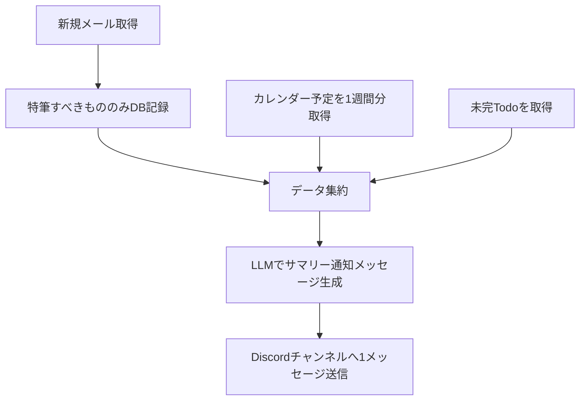
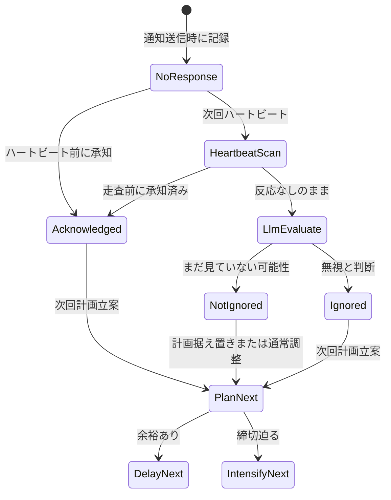

# nlreminder 要件定義

## 1. 概要

**nlreminder** は、LLM を連動させ、複数のデータソース（メール・カレンダー・Todo）を参照し、予定やタスクの取りこぼしを防ぐリマインドシステムである。

核心的な価値は次のバランスにある。

- 人間は頻繁なリマインドを鬱陶しく感じる
- 一方で、リマインドが弱いと「通知してくれなかった」と逆切れする

この矛盾を LLM の柔軟な判断に委ね、**必要なタイミングではしっかり、余裕があるときは控えめ**に通知する。

通知先は **Discord チャンネル**（単一サーバー・単一チャンネル）とする。自分専用のツールとして **単一ユーザー固定** で設計する。

---

## 2. データストア（概念レベル）

各ストアの役割を示す。**フィールド定義・列挙値・rig ツール・LLM JSON は [セクション 9](#9-技術仕様)** を参照。

| ストア | 役割 | 外部連携 |
|--------|------|----------|
| メール | 特筆すべきメールのみ保持 | Gmail 取得 |
| カレンダー | 予定の状態管理 | 既存 CalDAV サーバー（双方向同期） |
| Todo | タスクの状態管理 | Google Todo（現在使用中） |
| リマインド状況 | 通知ごとのユーザー反応の記録 | 内部 DB（SQLite） |
| リマインド計画 | LLM が決定した次回通知タイミング | 内部 DB（SQLite） |
| LLM 呼び出しログ | すべての LLM 呼び出し記録 | 内部 DB（SQLite） |
| 同期状態 | 外部 API の増分同期カーソル | 内部 DB（`sync_state`） |

**メールの掃除:** 特筆すべきもののみ保持する方針だが、定期的な掃除基準の設計が必要。**MVP では掃除機能は実装しない。**

---

## 3. 定期動作（毎朝）

**実行時刻:** JST 08:00（0:00〜8:00 は通知しない）



1. 新規メールを取得し、特筆すべきもののみ DB に記録
2. カレンダーの予定を **1 週間分** 取得
3. Todo リストの **未完タスク** を取得
4. 取得データを LLM に渡し、**朝サマリー** 通知メッセージを生成
5. Discord チャンネルに **1 メッセージ** にまとめて送信

計画に基づく随時リマインドは別フロー（セクション 7 参照）。朝通知はサマリー、随時通知は **1 件ごと**。

---

## 4. カレンダー予定の状態

| 状態 | 意味 |
|------|------|
| 予定 | カレンダーに追加されただけ。忘れている可能性あり |
| 準備 | 予定に向けた準備が完了。忘れずに準備できている |
| 完了 | 予定が終了し、無事完了した |

状態遷移は **ユーザーの Discord 上の自然言語発話を LLM が処理** して更新する。

---

## 5. Todo タスクの状態

| 状態 | 意味 |
|------|------|
| Todo | 未着手 |
| Ongoing | 進行中 |
| Done | 完了 |

**補足ルール:**

- Todo は「予定」ではなく「タスク」を記録する
- **締め切りのあるタスク** は、締め切りをカレンダーにも追加する（タイトルに `TODO` プレフィックスを付けて区別）
- タスクを忘れていないか、定期的に確認する
- Google Todo 側の完了状態は **定期取得で同期** する（カレンダー予定には外部完了同期の概念はない）

---

## 6. リマインド計画（LLM 判断）

予定・タスクの追加を検知したタイミング（**定期スキャン** または **Discord メッセージ受信時**）で、LLM が **初回通知タイミング** を判断し、リマインド計画 DB に登録する。

**重要:** すべての予定が Discord から追加されるわけではない。CalDAV / Google Todo との定期同期で変更を検知する。また、**すべての予定が通知必須ではない**（セクション 10.F 参照）。

判断例（LLM が文脈に応じて決定）:

- 時間がかかりそうなタスク → 初回通知は **1 週間前**
- 1 日で終わりそうなタスク → 締め切りの **3 日前**
- 1 日で終わるが予定が込み合っている → **早めに** 通知

リマインド計画の時刻になったらリマインドを実行し、**次回計画を立てる**。

**重複防止:** 1 つの予定・タスクに対して **アクティブな計画は常に 1 件のみ**。新規計画作成時は既存のアクティブ計画を無効化する。スヌーズ・延期時も同様に古い計画を明示的にキャンセルしてから新計画を作る。

---

## 7. リマインド状況とユーザー反応

通知後、Discord 上でユーザーが自然言語で反応する場合と、反応しない場合がある。反応に応じてリマインド状況 DB を更新する。

### 7.1 記録ルール

**通知送信時:** 直ちに **「反応なし」** を記録する（一定時間のタイマーは使わない）。

**通知〜次回ハートビートの間:** ユーザーが承知した旨を返信した場合、**「承知」** に更新する。

**次回ハートビート時:** まだ **「反応なし」** のままの通知を走査する。承知が記録されていなければ **無視候補** として LLM に渡す。

### 7.2 ハートビートと無視判定

ハートビートは **リマインド計画の実行** や **別タスクの通知処理** など、システムが何らかのスキャンを開始したタイミングで走る。固定間隔のポーリングではない。

走査をフックするタイミング:

- リマインド計画の実行時
- Discord への通知送信後
- 定期スキャン（5 分間隔）の開始時

無視候補の通知を LLM に渡し、**本当に無視されたか、まだ見ていないだけか** を文脈付きで判断させる。判断材料の例:

- 前回通知からの経過時間
- 予定・タスクの締切までの余裕
- ユーザーの状況（講義中など、まだ見ていない可能性）

**判断例:**

| 状況 | LLM の判断例 |
|------|-------------|
| 1/1 15:00 に通知、16:00 の別通知で走査。締切に余裕あり、1 時間未満 | まだ見ていないだけ → **次回計画は据え置き** |
| 同上だが締切が 17:00 | 16:00 時点で反応なしは危険 → **次回計画を直近に前倒し** |

### 7.3 通知方針の調整

| 状況 | 方針 |
|------|------|
| まだ余裕がある + 無視と判断 | 鬱陶しさを避けるため、**次回通知を遅らせる** |
| 締め切りが迫っている + 無視と判断 | **頻度・強度を上げて** 通知する |

「無視の定義」「うるさく通知の具体化」「承知の NLP 解析」は **LLM の判断に一任** する。スヌーズ・延期（「明日にして」等）は **対応する**。

**返信の紐付け:** Bot メッセージへの **Reply** であればその通知に紐付ける。Reply でない場合は、直近 24 時間以内の未承知通知を LLM に渡し、文脈から対象を推定する。



---

## 8. MVP スコープ

### 含める

- 毎朝 JST 08:00 のサマリー通知
- CalDAV（双方向）/ Google Todo / Gmail 連携
- LLM（LM Studio・ローカル）による通知文生成・リマインド計画・無視判定
- Discord（serenity）による通知・自然言語での予定/Todo 追加・反応取り込み
- リマインド状況に基づく通知方針の調整
- rig による LLM ツール呼び出し（DB / API をラップし、LLM が直接外部 API を叩かない）
- すべての LLM 呼び出しのログ記録（専用テーブル）
- テスト駆動開発

### MVP の成功基準

1. **毎朝 1 回** のサマリー通知が Discord に届く
2. Discord から自然言語で **予定・Todo を追加** できる
3. 通知対象の予定・タスクには **リマインド計画が存在** している（定期スキャンで外部追加分も検知）
4. リマインド計画の時刻になると **リマインドが実行** され、**次の計画が立てられる**
5. 無視候補の走査と LLM による **通知方針の調整** が動作する（セクション 7.2 の例に相当）

### 含めない（後回し）

- メール DB の自動掃除・掃除基準
- モバイルアプリ、Web UI
- 複数 Discord サーバー / 複数チャンネル対応
- ユーザーログイン、使用者検知
- プロンプトのバージョン管理
- 将来拡張（セクション 12）

---

## 9. 技術仕様（要約）

詳細は専用ドキュメントを **正本** とする。

| ドキュメント | 内容 |
|--------------|------|
| [`struct.md`](struct.md) | ドメイン型、DB 列、View、LLM 出力型、列挙値 |
| [`api.md`](api.md) | ライブラリ関数、rig ツール JSON、デーモン・LLM 内部 API |

以下は要約。矛盾時は上記 2 ファイルを優先する。

### 9.0 ドキュメント完成度と実装状況

| カテゴリ | 完成度 | 備考 |
|----------|--------|------|
| 要件・設計判断（§1–8, §10–12） | **高** | プロダクト方針は確定 |
| 初回セットアップ（`prep_manual.md`） | **高** | Google OAuth 手順は検証済み |
| 開発ルール（`dev.md`） | **高** | 実装・レビュー時の必読 |
| API / 構造体（`api.md`, `struct.md`） | **高** | 本実装の型・関数の正本 |
| DB スキーマ（§9.2） | **中** | migration `001` 確定。CalDAV 同期用カラム追加は §9.8 |
| 設定仕様（§9.1） | **高** | `.env` / `config.toml` とコード一致 |
| ライブラリ API（§9.3） | **中** | CalDAV / Google OAuth 読み取りは実装済み。Todo/Gmail/DB upsert は未 |
| rig ツール（§9.4） | **中** | シグネチャ確定、**未実装** |
| LLM JSON（§9.5） | **中** | スキーマ確定、**未実装** |
| Discord Embed（§9.6） | **低** | テンプレート名のみ確定、レイアウト詳細は最小定義 |

**実装済みモジュール:** `config`, `db`（migrate のみ）, `caldav`（読取）, `google`（OAuth）, `schedule/quiet_hours`, `app/daemon`（骨格）, `cli`（`run` / `setup google`）

---

### 9.1 設定ファイル

#### `.env`（秘密情報・接続先）

| 変数 | 必須 | 既定値 | 用途 |
|------|------|--------|------|
| `GOOGLE_CLIENT_ID` | setup 時 | — | OAuth |
| `GOOGLE_CLIENT_SECRET` | setup 時 | — | OAuth |
| `GOOGLE_REFRESH_TOKEN` | 運用時 | — | OAuth refresh |
| `GOOGLE_ACCOUNT_EMAIL` | ○ | — | 連携アカウント照合 |
| `LMSTUDIO_MODEL` | — | `Qwen3.6-35B` | LLM モデル名 |
| `LMSTUDIO_BASE_URL` | — | `http://localhost:1234/v1` | OpenAI 互換 API |
| `LMSTUDIO_TIMEOUT_SECS` | — | `120` | LLM HTTP タイムアウト（**未実装**。§9.8 参照） |
| `CALDAV_URL` | 運用時 | — | CalDAV ベース URL |
| `CALDAV_USERNAME` | 運用時 | — | Basic 認証 |
| `CALDAV_PASSWORD` | 運用時 | — | Basic 認証 |
| `DISCORD_TOKEN` | 運用時 | — | Bot トークン |
| `DISCORD_GUILD_ID` | 運用時 | — | 単一サーバー |
| `DISCORD_CHANNEL_ID` | 運用時 | — | 通知・会話チャンネル |
| `OAUTH_CALLBACK_PORT` | — | `8080` | `setup google` コールバック |

`setup google` 実行時は Google 関連のみ必須。CalDAV / Discord は空でよい。

#### `config.toml`（運用ポリシー）

| キー | 型 | 既定（example） | 用途 |
|------|-----|----------------|------|
| `timezone` | string | `Asia/Tokyo` | ローカル時刻の基準 |
| `morning_summary_hour` | u32 | `8` | 朝サマリー時刻（ローカル） |
| `quiet_hours_start` | u32 | `0` | 静かな時間帯開始（時、含む） |
| `quiet_hours_end` | u32 | `8` | 静かな時間帯終了（時、不含） |
| `scan_interval_secs` | u64 | `300` | 定期スキャン間隔 |
| `database_path` | path | `data/nlreminder.db` | SQLite |
| `backup_dir` | path | `backups` | 週次バックアップ先 |
| `google_tasks_list_id` | string | `""` | **確定:** 空 = Google Tasks の `@default` のみ使用 |
| `caldav_calendar_path` | string | `"/nozyjp/sshCalendar/"` | **確定:** 読取・書込・`TODO:` イベント作成はすべてこのカレンダー |

---

### 9.2 DB スキーマ（SQLite）

日時は **RFC 3339 / UTC** の `TEXT` で保存する（例: `2026-05-21T03:00:00+00:00`）。主キー `id` は **UUID v4** 文字列。

#### 列挙値（`TEXT` 制約）

| 用途 | 値 | 意味 |
|------|-----|------|
| `calendar_events.state` | `scheduled` | 予定（§4） |
| | `prepared` | 準備完了 |
| | `completed` | 完了 |
| `todos.state` | `todo` | 未着手（§5） |
| | `ongoing` | 進行中 |
| | `done` | 完了 |
| `reminder_plans.target_type` | `calendar_event` | カレンダー予定 |
| | `todo` | Todo |
| `reminder_plans.status` | `active` | 有効（対象あたり最大 1 件） |
| | `cancelled` | 無効化（スヌーズ・上書き時） |
| | `completed` | 実行済みで次計画へ移行 |
| `reminder_statuses.reaction` | `no_response` | 通知直後の初期状態（§7.1） |
| | `acknowledged` | 承知 |
| `llm_logs.call_type` | `morning_summary` | 朝サマリー生成 |
| | `single_reminder` | 随時リマインド文生成 |
| | `mail_classify` | メール分類 |
| | `ignore_evaluate` | 無視候補判定 |
| | `plan_create` | 初回/次回計画立案 |
| | `discord_intent` | ユーザー発話意図解析 |

#### テーブル定義

`migrations/001_initial.sql` が正。**追加予定カラムは §9.8**。

| テーブル | 主要カラム | 備考 |
|----------|-----------|------|
| `calendar_events` | `external_uid` UNIQUE, `external_etag`, `title`, `starts_at`, `ends_at`, `state`, `remind_enabled` | CalDAV UID + etag で upsert |
| `todos` | `external_task_id` UNIQUE, `title`, `due_at`, `state`, `remind_enabled` | Google Task ID |
| `mail_records` | `message_id` UNIQUE, `subject`, `sender`, `received_at` | 企業お声がけ等のみ永続 |
| `reminder_plans` | `target_type`, `target_id`, `scheduled_at`, `status` | `(status='active')` は `(target_type, target_id)` で一意（アプリ層で保証） |
| `reminder_statuses` | `plan_id`, `discord_message_id`, `reaction`, `notified_at`, `acknowledged_at` | 通知履歴は複数 |
| `llm_logs` | `call_type`, `model`, `input_summary`, `output_json`, `duration_ms`, `error` | 全 LLM 呼び出し |
| `sync_state` | `key` PK, `value` | 増分同期カーソル（下記） |

#### `sync_state` キー（確定）

| key | value 例 | 用途 |
|-----|----------|------|
| `gmail_history_id` | `"12345"` | Gmail `users.history.list` |
| `google_tasks_updated_min` | RFC3339 | Tasks 増分取得の下限 |
| `caldav:{calendar_href}:sync-token` | サーバー依存 | CalDAV sync-token（取得可能な場合） |

---

### 9.3 ライブラリ API（内部。LLM は直接呼ばない）

デーモン・rig ツールの下位層。**CLI サブコマンドは設けない**（人間向けは `run` / `setup google` のみ）。

#### 実装済み

```rust
// caldav
CalDavClient::new(env, settings) -> Result<Self>
CalDavClient::list_calendars() -> Result<Vec<CalendarCollection>>
CalDavClient::fetch_events(range_start, range_end) -> Result<Vec<CalDavEvent>>
default_fetch_range(settings) -> Result<(DateTime<Utc>, DateTime<Utc>)>
default_fetch_range_at(now, settings) -> Result<(DateTime<Utc>, DateTime<Utc>)>

// CalDavEvent（外部取得時の一時表現。DB 行とは別）
struct CalDavEvent {
    uid: String,           // iCalendar UID
    etag: Option<String>,
    href: Option<String>,  // CalDAV オブジェクト URL
    summary: String,
    starts_at: Option<DateTime<Utc>>,
    ends_at: Option<DateTime<Utc>>,
    all_day: bool,
}

// google
run_google_setup(env) -> Result<()>
check_google_connection(env) -> Result<()>
refresh_access_token(env) -> Result<AccessTokenResponse>

// schedule
adjust_for_quiet_hours(scheduled_at, settings) -> Result<DateTime<Utc>>
adjust_for_quiet_hours_at(scheduled_at, settings) -> Result<DateTime<Utc>>

// db
connect_and_migrate(path) -> Result<SqlitePool>
```

#### 未実装（仕様として確定）

| モジュール | 関数（案） | 責務 |
|-----------|-----------|------|
| `sync/calendar` | `sync_caldav_to_db(pool, client, settings)` | CalDAV → `calendar_events` upsert。nlreminder 未作成イベントはサーバー優先 |
| `sync/todo` | `sync_google_tasks_to_db(pool, env, settings)` | Tasks API → `todos` upsert |
| `sync/mail` | `fetch_new_gmail(pool, env)` | history ベース新着取得（分類前） |
| `caldav/write` | `create_or_update_event(...)` | `TODO:` プレフィックス付きイベント作成・etag 楽観ロック |
| `discord/bot` | serenity ハンドラ群 | 送受信・Reply 紐付け |
| `llm/client` | `complete_json<T>(call_type, prompt, schema)` | LM Studio + ログ記録 |

---

### 9.4 rig ツール仕様

LLM が呼び出す唯一のデータアクセス経路（§10.K）。rig の `ToolDefinition` として登録する。**引数・戻り値は JSON**。エラー時は `{ "error": "..." }` を返し、LLM ログに記録。

命名: `{群}_{動詞}`。読み取りは副作用なし。書き込みは DB / 外部 API を更新。

#### `calendar_*`

| ツール | 入力 | 出力 | 副作用 |
|--------|------|------|--------|
| `calendar_list_upcoming` | `{ "days": 7 }` | `{ "events": [CalendarEventView] }` | なし（DB 読取） |
| `calendar_get` | `{ "id": "uuid" }` | `{ "event": CalendarEventView }` | なし |
| `calendar_create` | `{ "title", "starts_at", "ends_at", "all_day"? }` | `{ "id", "external_uid"? }` | CalDAV PUT + DB insert |
| `calendar_update` | `{ "id", "title"?, "starts_at"?, "ends_at"?, "state"? }` | `{ "event": CalendarEventView }` | nlreminder 作成分のみ CalDAV 更新可 |
| `calendar_set_remind_enabled` | `{ "id", "enabled": bool }` | `{ "ok": true }` | DB のみ |

`CalendarEventView`（LLM 向け要約）:

```json
{
  "id": "uuid",
  "title": "Team meeting",
  "starts_at": "2026-05-21T03:00:00+00:00",
  "ends_at": "2026-05-21T04:00:00+00:00",
  "state": "scheduled",
  "remind_enabled": true,
  "all_day": false
}
```

#### `todo_*`

| ツール | 入力 | 出力 |
|--------|------|------|
| `todo_list_open` | `{}` | `{ "todos": [TodoView] }` |
| `todo_create` | `{ "title", "due_at"? }` | `{ "id" }` |
| `todo_update` | `{ "id", "title"?, "due_at"?, "state"? }` | `{ "todo": TodoView }` |
| `todo_set_remind_enabled` | `{ "id", "enabled": bool }` | `{ "ok": true }` |

`TodoView`: `{ "id", "title", "due_at", "state", "remind_enabled" }`

#### `mail_*`

| ツール | 入力 | 出力 |
|--------|------|------|
| `mail_list_unclassified` | `{ "limit": 20 }` | `{ "messages": [{ "message_id", "subject", "sender", "snippet", "received_at" }] }` |
| `mail_persist` | `{ "message_id", "subject", "sender", "received_at" }` | `{ "id" }` |

分類そのものは LLM の `mail_classify` 出力（§9.5）で行い、永続化は `mail_persist` または同期ジョブが担う。

#### `reminder_plan_*`

| ツール | 入力 | 出力 | 副作用 |
|--------|------|------|--------|
| `reminder_plan_get_active` | `{ "target_type", "target_id" }` | `{ "plan": ReminderPlanView \| null }` | なし |
| `reminder_plan_create` | `{ "target_type", "target_id", "scheduled_at", "reason"? }` | `{ "plan": ReminderPlanView }` | 既存 active を `cancelled` にしてから insert |
| `reminder_plan_cancel` | `{ "id" }` | `{ "ok": true }` | status → `cancelled` |
| `reminder_plan_list_due` | `{ "before": "RFC3339" }` | `{ "plans": [ReminderPlanView] }` | なし |

`scheduled_at` 登録時は `adjust_for_quiet_hours` を必ず通す。

#### `reminder_status_*`

| ツール | 入力 | 出力 |
|--------|------|------|
| `reminder_status_list_no_response` | `{ "since_hours": 24 }` | `{ "statuses": [ReminderStatusView] }` |
| `reminder_status_acknowledge` | `{ "id" }` | `{ "ok": true }` |

通知送信はデーモンが `reminder_status` 行を `no_response` で insert する（ツール化しない）。

#### `event_state_*`

`calendar_update` / `todo_update` の `state` 引数と統合済み。**独立ツールは設けない**（重複回避）。

---

### 9.5 LLM 入出力 JSON

LM Studio には **JSON mode / structured output** を使い、パース失敗時は 1 回リトライして `llm_logs.error` に記録。プロンプト本文はコード内定数（バージョン管理不要）。

#### 共通

- 日時: RFC 3339
- `call_type` とスキーマは 1:1

#### `morning_summary`（出力）

LLM は **Embed の本文フィールドのみ**生成（§10.G）。Discord 枠組みはシステムが付与。

```json
{
  "calendar_lines": ["5/21 10:00 ミーティング", "..."],
  "todo_lines": ["レポート提出（5/22 締切）", "..."],
  "mail_lines": ["◯◯社からのご連絡: ..."],
  "note": "任意の一言（省略可）"
}
```

#### `single_reminder`（出力）

```json
{
  "title": "短い見出し",
  "body": "本文（1〜3 文）",
  "urgency": "low | normal | high"
}
```

#### `mail_classify`（出力。メール 1 件あたり）

§10.H に準拠。

```json
{
  "message_id": "<Gmail Message-ID>",
  "category": "payment | outreach | assignment_deadline | assignment_submitted | other",
  "notify_in_summary": true,
  "persist": false
}
```

| category | notify_in_summary | persist |
|----------|-------------------|---------|
| `payment` | true | false |
| `outreach` | true | **true** |
| `assignment_deadline` | true | false |
| `assignment_submitted` | false | false |
| `other` | false | false |

#### `ignore_evaluate`（出力。無視候補 1 件あたり）

```json
{
  "status_id": "uuid",
  "judgment": "not_seen | ignored",
  "adjustment": "keep | delay | intensify",
  "next_scheduled_at": "RFC3339（adjustment が delay/intensify のとき必須）",
  "reason": "判断理由（ログ用）"
}
```

#### `plan_create`（出力）

```json
{
  "target_type": "calendar_event | todo",
  "target_id": "uuid",
  "scheduled_at": "RFC3339",
  "reason": "判断理由"
}
```

#### `discord_intent`（出力。ユーザー 1 メッセージあたり）

```json
{
  "intent": "add_calendar | add_todo | update_state | acknowledge | snooze | exclude_reminder | chat",
  "target_id": "uuid（update_state / acknowledge / snooze / exclude 時）",
  "payload": {}
}
```

`payload` 例:

| intent | payload |
|--------|---------|
| `add_calendar` | `{ "title", "starts_at", "ends_at", "all_day"? }` |
| `add_todo` | `{ "title", "due_at"? }` |
| `update_state` | `{ "kind": "calendar_event|todo", "state": "prepared|..." }` |
| `snooze` | `{ "scheduled_at": "RFC3339" }` |
| `exclude_reminder` | `{ "enabled": false }` |
| `acknowledge` | `{}` |
| `chat` | `{ "reply": "任意応答文" }` |

Reply 付きメッセージでは `status_id` をシステムがプロンプトに注入し、`acknowledge` の対象を固定する。

---

### 9.6 Discord Embed テンプレート

LLM は §9.5 の文字列のみ生成。色・フッター・フィールド分割は Rust 側。

| テンプレート | 用途 | 既定色（Discord） |
|-------------|------|-------------------|
| `morning_summary` | 朝 1 通 | `#5865F2`（ blurple ） |
| `single_reminder` | 随時リマインド | urgency で `low=#57F287`, `normal=#FEE75C`, `high=#ED4245` |
| `mail_alert` | サマリー外の即時メール（将来） | `#EB459E` |

MVP では `morning_summary` と `single_reminder` のみ使用。

---

### 9.7 ドメイン型（Rust ↔ DB マッピング）

実装時は `src/models/` に集約する想定。

```rust
struct CalendarEvent {
    id: Uuid,
    external_uid: Option<String>,
    external_etag: Option<String>,
    title: String,
    starts_at: Option<DateTime<Utc>>,
    ends_at: Option<DateTime<Utc>>,
    state: CalendarEventState,
    remind_enabled: bool,
    created_at: DateTime<Utc>,
    updated_at: DateTime<Utc>,
}

enum CalendarEventState { Scheduled, Prepared, Completed }

struct Todo { /* todos テーブルに対応 */ }
enum TodoState { Todo, Ongoing, Done }

struct ReminderPlan {
    id: Uuid,
    target_type: ReminderTargetType,
    target_id: Uuid,
    scheduled_at: DateTime<Utc>,
    status: ReminderPlanStatus,
    created_at: DateTime<Utc>,
    updated_at: DateTime<Utc>,
}

enum ReminderTargetType { CalendarEvent, Todo }
enum ReminderPlanStatus { Active, Cancelled, Completed }

struct ReminderStatus {
    id: Uuid,
    plan_id: Option<Uuid>,
    discord_message_id: Option<String>,
    reaction: ReminderReaction,
    notified_at: DateTime<Utc>,
    acknowledged_at: Option<DateTime<Utc>>,
    created_at: DateTime<Utc>,
    updated_at: DateTime<Utc>,
}

enum ReminderReaction { NoResponse, Acknowledged }
```

DB 上の snake_case 文字列と `strum` / 手動 `FromStr` で相互変換する。

---

### 9.8 確定判断・将来 migration

#### 確定した判断（2026-05）

| 項目 | 決定内容 |
|------|----------|
| **Google Tasks リスト** | **`@default` のみ**。`google_tasks_list_id` は空のまま |
| **CalDAV カレンダー** | **`sshCalendar` に固定**（`caldav_calendar_path = "/nozyjp/sshCalendar/"`）。予定の読取・`TODO:` 締切イベントの作成・更新はすべてここ |
| **メール分類** | **常に LLM 一任**。送信者ドメイン等のルールベース分類は設けない |
| **CalDAV から消えた予定** | DB 行は **削除しない**。`state = completed` に更新して履歴として残す |
| **朝サマリーが空の日** | **短い 1 通は送る**（例:「本日の予定はありません」）。08:00 のリズムを維持 |
| **Todo 締切 → CalDAV イベント** | タイトル `TODO: {task title}`。**終日**（締切日 1 日）。時刻付き due は Tasks 側の `due` を正とし、カレンダーは日付のみ |
| **Gmail 初回同期** | historyId 未設定時は **直近 7 日分**を取得（朝サマリーの窓と揃える） |
| **Discord 会話トリガー** | 通知チャンネル内の **ユーザー投稿はすべて** LLM 意図解析。Bot 自身・Webhook の投稿は無視 |
| **API / LLM 一時障害** | 当該処理は **スキップ**し次スキャン（5 分後）へ。エラーは tracing + `llm_logs.error`。JSON パース失敗時のみ **1 回リトライ** |
| **週次 DB バックアップ** | **日曜 JST 04:00** に実行。`backup_dir` へコピー、直近 4 世代保持。Discord 通知はしない |

#### 仕様として決めたが migration / 実装待ち

| 項目 | 内容 |
|------|------|
| `calendar_events.external_href` | CalDAV オブジェクト URL（更新 PUT 用） |
| `calendar_events.all_day` | 終日フラグ |
| `calendar_events.nlreminder_owned` | `TODO:` 由来など nlreminder 作成イベントの識別 |
| `LMSTUDIO_TIMEOUT_SECS` | `.env.example` に追記済み。`config` 読み込みは未実装 |
| Gmail `users.history.list` vs `messages.list(q=after:)` | **historyId 方式**を採用（効率・重複少） |

#### 意図的に後回し

- メール DB 掃除基準
- CalDAV sync-token 未対応サーバー向けフォールバック（現状は time-range REPORT のみ）
- `mail_alert` 即時 Embed（MVP はサマリー内通知のみ）

---

## 10. 設計判断

### A. プロダクト・スコープ

| 項目 | 判断 |
|------|------|
| 利用者モデル | **単一ユーザー固定**（自分専用） |
| 対象外 | モバイル、Web UI、複数 Discord サーバー/チャンネル、ユーザーログイン、使用者検知 |

### B. アーキテクチャ・実行モデル

| 項目 | 判断 |
|------|------|
| プロセス形態 | **単一常駐デーモン**（serenity + tokio）。JST 08:00 トリガー・5 分スキャン・計画時刻判定はすべてデーモン内の tokio タスクで処理。systemd timer 等は不要 |
| 毎朝の定義 | **JST 08:00** |
| 定期スキャン | CalDAV / Google Todo / Gmail を **5 分間隔** でポーリング |
| ハートビート | **リマインド実行・通知送信・定期スキャン開始時** にリマインド状況を走査。無視判定は LLM が文脈判断（セクション 7.2） |
| 予定追加の検知 | **定期スキャン + Discord メッセージ受信時** |
| LLM ツール基盤 | **rig** を使用。`rust-mcp-sdk` は使用しない。LLM は rig 経由のツールのみ呼び出し、DB / API はラップして渡す |

### C. データ・状態管理

| 項目 | 判断 |
|------|------|
| DB | **SQLite**（できるだけシンプルに） |
| 外部 ID | メールは Message-ID を流用。CalDAV は iCalendar **UID + etag** を流用。Google Task は Task ID を流用。内部には UUID を primary key として持つ |
| リマインド計画と状況 | 1 予定・タスクに **アクティブ計画は 1 件**。通知履歴（リマインド状況）は複数保持 |
| LLM ログテーブル | `id`, `created_at`, `call_type`, `model`, `input_summary`, `output_json`, `duration_ms`, `error` |
| 状態遷移 | ユーザーの Discord 発話を **LLM が処理** |
| 競合解決 | Todo 締切は必ずカレンダーにも記録。カレンダー側は **`TODO` プレフィックス** で区別 |
| CalDAV 競合 | nlreminder が作成していないイベントは **サーバー側を正** とする。nlreminder 作成イベント（`TODO` プレフィックス）は etag による楽観的ロック |
| 冪等性 | 単一デーモン + アクティブ計画 1 件制約で十分。追加の dedupe 機構は不要 |

### D. 外部連携

| 項目 | 判断 |
|------|------|
| CalDAV | Tailnet 上の CalDAV サーバー（認証情報は `.env`）、**双方向**。**カレンダーは `sshCalendar` 固定**（`config.toml` の `caldav_calendar_path`） |
| Google Todo | **Tasks API**。OAuth2（インストール型アプリ）。スコープ: `tasks`（読み書き。Discord からの完了操作に必要） |
| Gmail | **Gmail API**（Google Todo と同一 OAuth）。スコープ: `gmail.readonly`。前回同期以降の新着を取得 |
| Google アカウント | **`.env` の `GOOGLE_ACCOUNT_EMAIL`** で連携アカウントを指定 |
| Discord | **serenity**（Bot。メッセージ送受信） |
| 認証情報 | **`.env`**（初回 OAuth セットアップ手順は [`prep_manual.md`](prep_manual.md) 参照） |
| デプロイ | **自宅サーバー**（Tailnet） |
| Todo 締切 → カレンダー | Todo 追加・更新検知時（スキャン or Discord）に **即時** CalDAV イベントを作成・更新 |

### E. LLM 設計

| 項目 | 判断 |
|------|------|
| モデル | **ローカル LLM（LM Studio）**。既定: **Qwen3.6 35B**（`.env` の `LMSTUDIO_MODEL` で変更可） |
| 接続 | OpenAI 互換 API `http://localhost:1234/v1`。タイムアウト既定 120s（`.env` の `LMSTUDIO_TIMEOUT_SECS`） |
| コンテキスト | 約 50k。1 週間分のデータは **大きく切り詰めない** |
| 出力形式 | **JSON**（具体構造は [§9.5](#95-llm-入出力-json)） |
| プロンプト管理 | 不要 |
| コスト上限 | なし（ローカル） |
| 障害時フォールバック | 不要（ローカル） |
| プライバシー | ローカル LLM のため **データをそのまま送信してよい** |

### F. リマインドロジック

| 項目 | 判断 |
|------|------|
| 無視・うるささ・承知解析 | **LLM に一任** |
| スヌーズ・延期 | **対応する**（古い計画をキャンセルしてから新計画を作成） |
| 外部完了同期 | Todo は定期取得で確認。カレンダー予定に外部完了の概念はない |
| 静かな時間帯 | **0:00〜8:00 は通知しない**（ハードコード）。計画時刻がこの帯に入る場合は **当日 8:00 にずらす** |
| 重複通知抑制 | **1 予定 = 1 アクティブ計画**（セクション 6 参照）。朝サマリーと随時リマインドは **役割が異なるため意図的に両方送る**（朝=一覧、随時=アクション促し） |
| 通知対象の選定 | **締切あり Todo は必ず通知対象**。カレンダー予定は LLM が要否を判断。Discord で「リマインド不要」と言えば除外 |

### G. 通知・UX

| 項目 | 判断 |
|------|------|
| メッセージ形式 | **Embed**。フォーマットはシステム側、LLM が吐くのは **内容のみ** |
| Embed テンプレート | `morning_summary` / `single_reminder` / `mail_alert` の 3 種 |
| 朝 vs 随時 | **両方**。朝はサマリー、随時は計画に基づく |
| 粒度 | 朝は **1 メッセージに全件**、それ以外は **1 件ごと** |
| 設定変更 | **設定ファイルのみ**（Discord 自然言語では変更しない） |
| 自然言語で受け付ける操作 | 予定/Todo 追加、状態更新、スヌーズ、承知、リマインド除外 |

### H. メール

| 種別 | 通知 | DB 記録 | 分類 |
|------|------|---------|------|
| 決済通知 | サマリーで通知 | 不要 | **LLM のみ**（ルールベースなし） |
| 企業からのお声がけ | 通知 | **必須** | 同上 |
| 課題の期限通知 | 通知 | 不要（別途記録済み） | 同上 |
| 課題の提出通知（自分が提出） | 不要 | 不要 | 同上 |

掃除基準は MVP では決めない。**分類は MVP 以降も LLM 一任**（§9.8）。

### I. 信頼性・運用

| 項目 | 判断 |
|------|------|
| エラーハンドリング | Rust + **color-eyre** を各所に追加 |
| Google API レート制限 | 5 分ポーリングで十分。追加スロットリングは不要（問題が出たら対応） |
| ログ | **すべての LLM 呼び出し** をログ + 専用テーブルに記録 |
| バックアップ | **日曜 JST 04:00**、週 1 回。`backup_dir/nlreminder-YYYYMMDD.db` に SQLite をコピー。直近 4 世代を保持（§9.8） |

### J. セキュリティ・プライバシー

| 項目 | 判断 |
|------|------|
| Discord アクセス | 自分だけのサーバーに招待するため **追加制御不要** |
| LLM プロバイダ | ローカル（自分） |

### K. rig ツール分割

| ツール群 | 責務 |
|----------|------|
| `calendar_*` | CalDAV 予定の取得・作成・更新 |
| `todo_*` | Google Task の取得・更新 |
| `mail_*` | Gmail 新着取得 |
| `reminder_plan_*` | リマインド計画の CRUD |
| `reminder_status_*` | リマインド状況の読み書き |
| `event_state_*` | カレンダー/Todo 状態の更新 |

LLM は上記ツール経由でのみデータにアクセスする。外部 API の直接呼び出しは禁止。**各ツールの JSON 仕様は [§9.4](#94-rig-ツール仕様)**。

### L. テスト・品質

| 項目 | 判断 |
|------|------|
| 方針 | **テスト駆動** を志向 |
| LLM 出力 | モックでテスト |
| 時間依存ロジック | `tokio::test` + 時刻注入（`chrono` のラップ or trait） |
| 統合テスト | 外部 API はスタブで隔離 |

---

## 11. 初回セットアップ

実装・運用開始前に一度だけ行う作業。

| 項目 | 手順 |
|------|------|
| LM Studio | **Qwen3.6 35B** を LM Studio にロードし、サーバーを起動。`.env` に `LMSTUDIO_MODEL` を設定 |
| Google OAuth | [`prep_manual.md`](prep_manual.md) に従い、Cloud プロジェクト作成・API 有効化・リフレッシュトークン取得を行う |
| 連携アカウント | `.env` の `GOOGLE_ACCOUNT_EMAIL` に Todo・Gmail を連携する Google アカウントのアドレスを設定 |

**開発者向け:** 本実装に入る前に [`dev.md`](dev.md) を読むこと。

---

## 12. 将来拡張

- メール DB の自動掃除
- 複数通知チャネル（Slack, メール等）
- ユーザーの反応パターンからリマインド間隔を学習・調整
- Todo 締切のカレンダー自動追加の高度化
